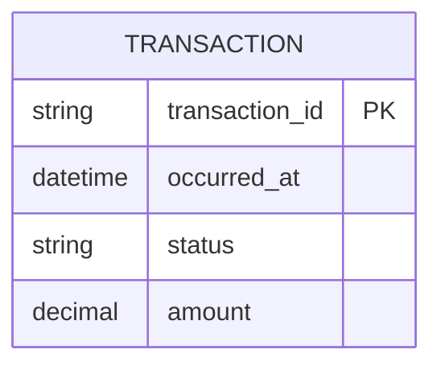

## ERD lógico simplificado

## Supuestos
- Se modela únicamente la entidad **TRANSACTION**, ya que es el único concepto de datos explícitamente necesario para representar el historial.
- Se incluyen solo atributos necesarios para filtros y visualización: fecha, estado y monto.
- El campo status se incorpora porque el PRD exige filtrar por estado, aunque sus valores canónicos no están definidos en el documento.
- No se incluyen datos sensibles como PAN completo, CVV, credenciales ni mecanismos de autorización.

## Preguntas abiertas
- ¿Qué valores canónicos debe aceptar el campo status (por ejemplo, aprobado, rechazado, pendiente)?
- ¿Se necesita exponer un identificador legible de la transacción o basta con un ID interno?
- ¿La vista debe soportar moneda explícita en el monto, o se asume una única moneda para este alcance?