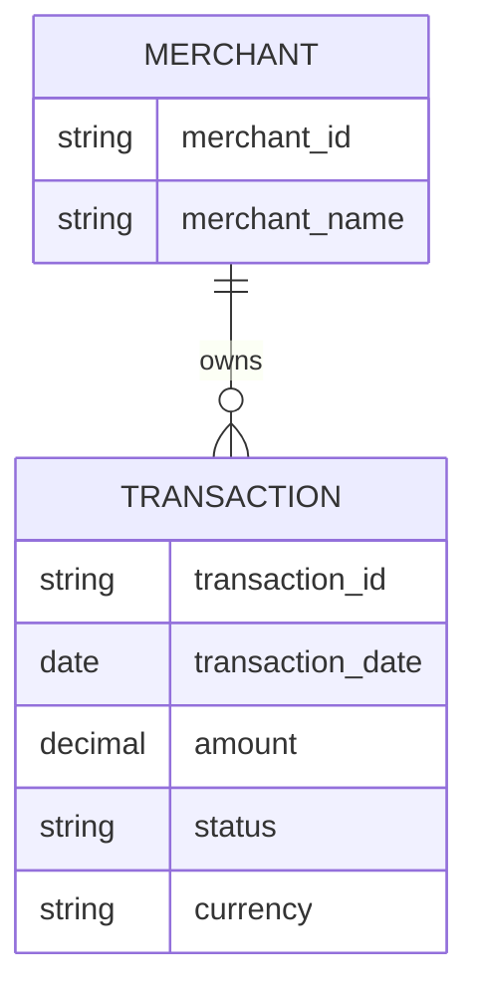

# ERD — Historial de Transacciones

## Propósito y alcance

Representar las entidades mínimas necesarias para consultar el historial de transacciones.

## Diagrama

## Supuestos

- Cada transacción pertenece a un comercio.
- Solo se representan los datos necesarios para consulta.
- No se almacenan datos sensibles.

## Preguntas abiertas

- ¿Qué estados válidos deben mostrarse en el historial?

- ¿Qué filtros deben soportarse: fecha, comercio, estado, moneda o combinación de ellos?

- ¿El historial debe incluir solo transacciones finalizadas o también aquellas en proceso o rechazadas?