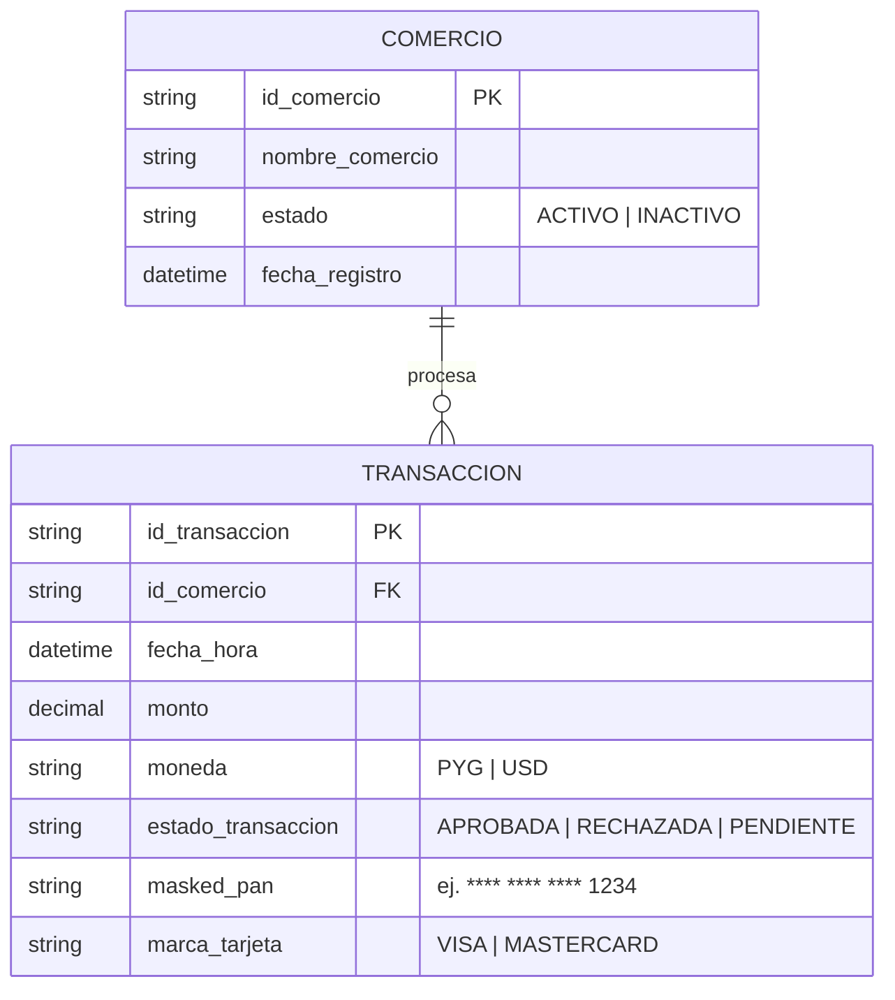

# Modelo Entidad-Relación Lógico (ERD) — Historial de Transacciones

## 1. Propósito y Alcance

Este documento define el modelo de datos lógico simplificado en formato Mermaid para dar soporte a la consulta de historial de transacciones de los últimos 90 días en la pasarela **LegacyPay**.

El modelo garantiza la privacidad por diseño (excluyendo PAN completo y CVV) e incluye únicamente las entidades y atributos estrictamente requeridos para la consulta paginada y el filtrado por fecha, estado y monto.

---

## 2. Diagrama Entidad-Relación (Mermaid)

---

## 3. Supuestos de Diseño

1. **Atributo vs. Entidad:** El estado de la transacción (`estado_transaccion`) se representa como un atributo enumerable (enum/string) dentro de la tabla `TRANSACCION`, evitando la creación de una tabla aislada de estados para prevenir sobre-diseño.
2. **Mascaramiento Permanente:** La columna `masked_pan` almacena únicamente los últimos 4 dígitos del número de tarjeta. Los datos PCI sensibles (PAN completo, CVV, PIN) no forman parte del modelo lógico ni de la base de datos de consulta.
3. **Cardinalidad:** Un `COMERCIO` puede poseer cero o muchas (`0..N`) registros de `TRANSACCION`. Cada `TRANSACCION` pertenece obligatoriamente a un único `COMERCIO`.
4. **Filtros por Fecha y Monto:** Los campos `fecha_hora` y `monto` cuentan con tipos de datos estándar indexables en la base de datos relacional subyacente para soportar consultas por rango de tiempo y volumen.

---

## 4. Preguntas Abiertas

- **[PREGUNTA ABIERTA 01]:** ¿Es necesario soportar múltiples monedas (`PYG`, `USD`, etc.) o todas las transacciones de LegacyPay se procesan exclusivamente en una moneda local por defecto?
- **[PREGUNTA ABIERTA 02]:** ¿Se requiere una entidad adicional de `REEMBOLSO` o `DEVOLUCION` vinculada a la transacción para la v1, o las devoluciones se modelan como un estado particular (`estado_transaccion = REEMBOLSADA`)?
