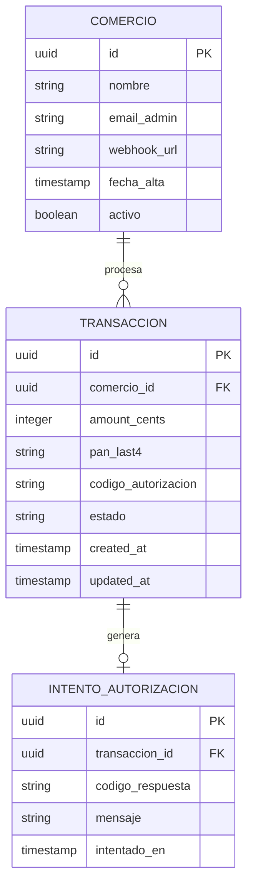

# ERD · Historial de Transacciones · LegacyPay

> **Escenario A del Lab 2** · versión de referencia canónica.
>
> **Trazabilidad:** cada entidad viene de la sección 3 del `PRD.md` · cada cardinalidad refleja las reglas del negocio.

---

## Diagrama Entidad-Relación



---

## Notas de diseño

### Trazabilidad PRD ↔ ERD

| Entidad del PRD (§3) | Tabla en ERD | Notas |
|----------------------|--------------|-------|
| COMERCIO | `COMERCIO` | 1 comercio · N transacciones |
| TRANSACCION | `TRANSACCION` | Cada transacción pertenece a UN comercio |
| ESTADO | Campo `estado` en `TRANSACCION` | NO es tabla independiente · es un valor enumerado *(pending · approved · rejected · refunded · cancelled)* |

**Aplicación de FAQ 2 del Lab 2:** *"filtros" · "paginación" · "estado" son mecanismos o atributos · NO entidades*. Por eso `estado` es un campo string dentro de `TRANSACCION` con constraint `CHECK`, no una tabla `ESTADO` separada con FK.

### Restricciones a implementar en migración

```sql
-- Constraint del estado (regla del PRD sección 3)
ALTER TABLE transaccion
ADD CONSTRAINT chk_estado
CHECK (estado IN ('pending', 'approved', 'rejected', 'refunded', 'cancelled'));

-- Constraint del monto (regla del PRD Historia 1)
ALTER TABLE transaccion
ADD CONSTRAINT chk_amount_positivo
CHECK (amount_cents > 0);

-- Constraint del PAN last4 (regla PCI-DSS del PRD sección 5)
ALTER TABLE transaccion
ADD CONSTRAINT chk_pan_last4_format
CHECK (pan_last4 ~ '^\d{4}$');

-- Índice compuesto para paginación por cursor (ADR-0003)
CREATE INDEX idx_transaccion_comercio_created
ON transaccion (comercio_id, created_at DESC, id DESC);
```

### Decisión sobre INTENTO_AUTORIZACION

Se incluye como entidad independiente porque:
- Tiene ciclo de vida propio *(cada intento se registra aunque el resultado sea el mismo)*
- Es auditable *(los intentos rechazados también quedan para investigación de fraude)*
- No es un atributo de TRANSACCION *(múltiples intentos por transacción)*

Pasa el **test rápido de la FAQ 2:** tiene ID propio · atributos · ciclo de vida · se puede referenciar desde otros lugares → entidad válida.

### Auditoría del diagrama con 3 preguntas rápidas

1. **¿Toda entidad del PRD sección 3 aparece como tabla?** ✅ COMERCIO · TRANSACCION · (ESTADO va como campo por el criterio de FAQ 2)
2. **¿Las cardinalidades reflejan las reglas del PRD?** ✅ 1 comercio → N transacciones (regla "cada comercio procesa múltiples pagos") · 1 transacción → 0/1 intento inicial (opcional para casos históricos migrados sin intento registrado)
3. **¿Las FKs están presentes?** ✅ `TRANSACCION.comercio_id → COMERCIO.id` · `INTENTO_AUTORIZACION.transaccion_id → TRANSACCION.id`

---

*ERD · Escenario A · Historial de Transacciones · LegacyPay · Cohorte 2026-I · versión de referencia canónica.*
