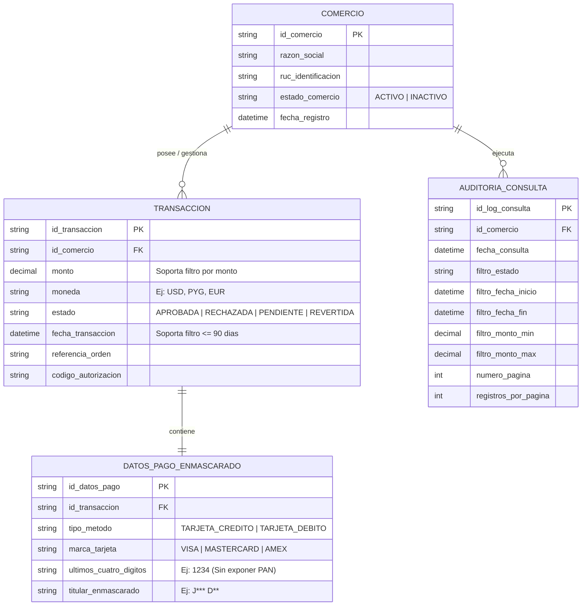

# ERD — Historial de Transacciones

## Propósito y alcance

El propósito de este modelo de datos lógico es soportar la consulta del historial de transacciones para comercios autorizados dentro de la ventana de los últimos 90 días, incluyendo filtros por fecha, estado y monto, garantizando la protección de datos sensibles mediante el enmascaramiento de información y la auditoría de accesos.

## Diagrama

## Supuestos

1. Cada comercio posee un identificador único `id_comercio` y un estado operacional.
2. Los datos de pago confidenciales (como el PAN completo o CVV) nunca se almacenan en este modelo; en su lugar, se asocian a un registro enmascarado `DATOS_PAGO_ENMASCARADO` para la visualización segura del comercio.
3. Se registran auditorías de consulta (`AUDITORIA_CONSULTA`) para cumplir con los requisitos de trazabilidad y seguridad operativa en cada solicitud.

## Preguntas abiertas

1. ¿Se requiere indexar el campo `referencia_orden` para búsquedas directas en el historial?
2. ¿Qué longitud exacta deben tener las descripciones de los estados de transacción?
