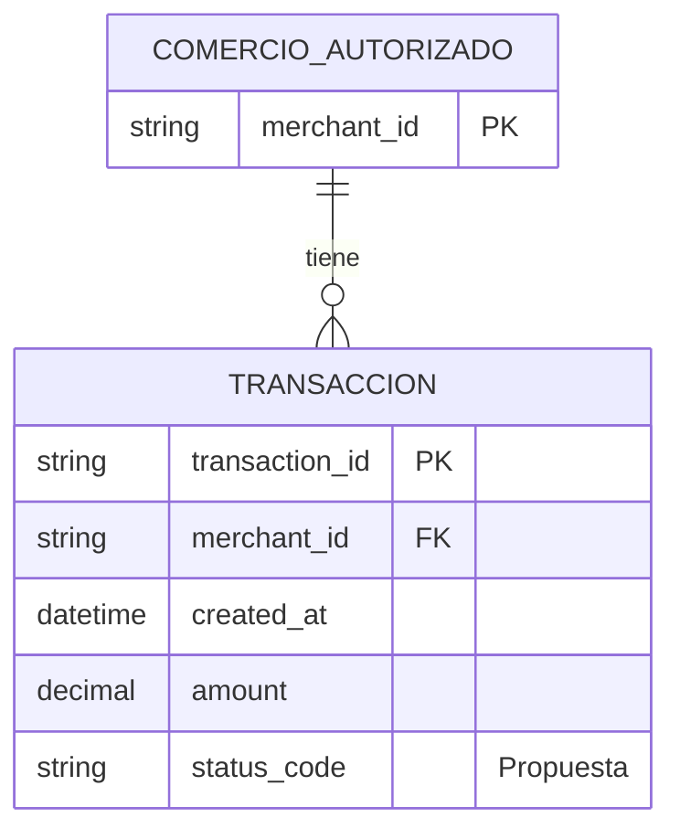

Basado en PRD.md, este es un ERD lógico simplificado para el historial de transacciones, dejando solo los datos necesarios para filtros y visualización.

1. Bloque Mermaid

2. Supuestos breves

- Se asume que el historial está asociado a un comercio autorizado y que cada transacción pertenece a uno de ellos.
- Se consideran solo los campos necesarios para los filtros mínimos del PRD: fecha, monto y estado.
- Se marca como propuesta el campo status_code porque el PRD menciona estados de transacción, pero no define su esquema exacto.
- No se modelan detalles de tarjeta, datos de autenticación, ni reglas de autorización o privacidad; eso queda fuera del alcance del ERD.

3. Preguntas abiertas

- ¿Cuál es el conjunto exacto de valores permitidos para el estado de la transacción?
- ¿Qué campos adicionales deben mostrarse en la vista de resumen del historial?
- ¿Se debe filtrar por montos exactos, rangos de montos, o ambos?
- ¿Cuál es el tamaño de página por defecto y el máximo permitido?