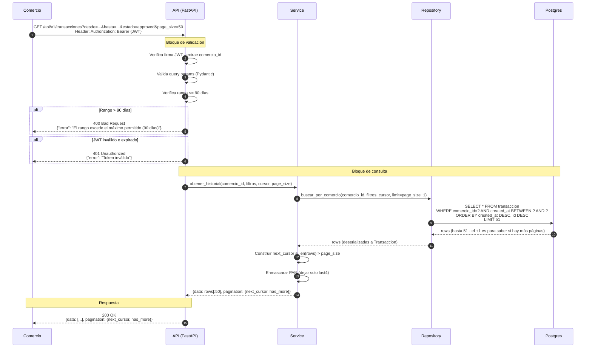

# Diagrama de Secuencia · GET /api/v1/transacciones · LegacyPay

> **Escenario A del Lab 2** · versión de referencia canónica.
>
> **Aplicado a la Historia INVEST #1 del PRD:** consultar transacciones recientes.
>
> **Contrato observable:** este diagrama define el flujo que los tests de aceptación deben verificar.

---

## Flujo principal · Happy Path + validaciones + paginación

---

## Notas del diagrama

### Trazabilidad con el PRD

| Paso del diagrama | Requisito del PRD |
|-------------------|-------------------|
| Verifica firma JWT · extrae comercio_id | §5 Autenticación + §3 Regla "solo consultar sus propias transacciones" |
| Verifica rango <= 90 días | §5 Retención + §3 Regla "máximo 90 días hacia atrás" |
| Ordena por `created_at DESC · id DESC` | §3 Regla "las más recientes primero" |
| Enmascarar PAN (solo last4) | §5 Cumplimiento PCI-DSS |
| LIMIT 51 (page_size+1) | ADR-0003 · técnica de paginación cursor |
| Respuesta con pagination.next_cursor | §4 Historia 3 + ADR-0003 |

### Auditoría del diagrama con 2 preguntas rápidas

1. **¿Cada mensaje representa una interacción real?** ✅ Los pasos 1-11 son llamadas efectivas (HTTP · función · SQL) · no hay pasos decorativos ni interacciones que la implementación no vaya a ejecutar.
2. **¿Los flujos alternativos (rango > 90 días · JWT inválido) están?** ✅ Los 2 casos negativos están explícitos con las respuestas HTTP esperadas · sirven como base para los tests de casos borde.

### Base para los tests de aceptación

Con este diagrama, los tests unitarios e integración pueden derivarse directamente:

**Tests unitarios (Service · con mocks del Repository):**
- `test_obtener_historial_devuelve_hasta_page_size_elementos`
- `test_obtener_historial_construye_next_cursor_si_hay_mas`
- `test_obtener_historial_enmascara_pan_last4`

**Tests unitarios (validación en API):**
- `test_rango_mayor_a_90_dias_devuelve_400`
- `test_jwt_invalido_devuelve_401`
- `test_desde_mayor_a_hasta_devuelve_400`

**Tests de integración (opcional · reto plus):**
- `test_endpoint_consulta_completa_end_to_end`
- `test_paginacion_no_repite_elementos_entre_paginas`

### Decisión sobre orden de las capas

El diagrama respeta Clean Architecture del PRD:
- **API (Router)** solo maneja HTTP · validaciones de contrato · códigos de respuesta
- **Service** contiene lógica de negocio (construir cursor · enmascarar PAN · aplicar reglas)
- **Repository** único que habla con Postgres

**Test de la separación:** si mañana cambiamos de FastAPI a Django · el Service y Repository no se tocan. ✅

---

*Diagrama de Secuencia · Escenario A · Historial de Transacciones · LegacyPay · Cohorte 2026-I · versión de referencia canónica.*
