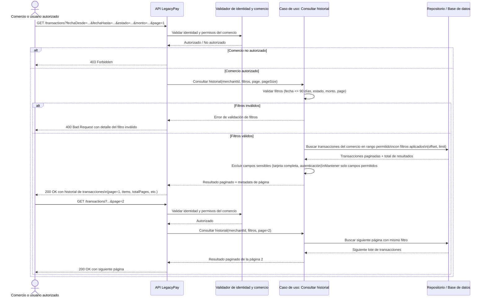

## Diagrama de secuencia: consulta de historial de transacciones

Basado en la Historia 1 y los criterios de aceptación del PRD, este flujo cubre autenticación/autorización, validación de filtros, consulta paginada y manejo de errores sin inventar servicios externos.

### Observaciones
- La validación de identidad y comercio se realiza en el componente de autorización/validación.
- Los filtros se validan antes de consultar el repositorio, con la restricción de 90 días.
- La consulta es paginada y conserva la misma lógica en páginas subsiguientes.
- La respuesta correcta entrega solo campos permitidos, sin tarjeta completa ni datos de autenticación.
- El flujo alternativo cubre error por comercio no autorizado y error por filtros inválidos.