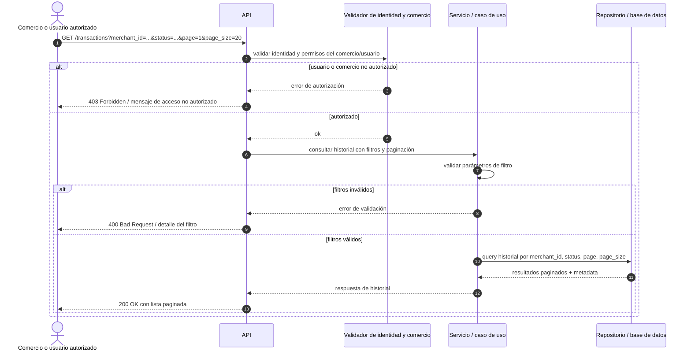

# Secuencia — Consulta de historial de transacciones

## Diagrama

## Supuestos

- La validación de identidad y comercio sucede antes de consultar datos.
- El actor `Merchant` representa a un comercio o usuario autorizado dentro del caso de uso.
- El `Service` es responsable de validar filtros y coordinar la consulta al repositorio.
- La paginación se representa con `page` y `page_size` como parámetros mínimos.
- La base de datos solo responde con los registros necesarios para la consulta.

## Preguntas abiertas

- ¿La API debe devolver 403 o 401 para comercio no autorizado? El PRD no lo define con precisión.
- ¿`status` es un único valor o un conjunto de estados permitidos para el filtro?
- ¿La consulta exige ordenamiento explícito por fecha más reciente primero?
- ¿La respuesta debe incluir metadata de paginación adicional, como `total_pages` o `total_records`?

### Auditoría de la secuencia

- ¿La autorización ocurre antes de consultar datos? Sí, en el flujo principal se valida antes de acceder a la consulta.
- ¿Cada participante está justificado? Sí: comercio, API, validador, servicio y repositorio.
- ¿El orden de mensajes es coherente? Sí, respetando validación, filtros y consulta paginada.
- ¿Existe al menos un flujo de error? Sí, hay rama de autorización y rama de filtros inválidos.
- ¿Coincide con el PRD y el ERD? Sí, se consulta transacciones por comercio y se usa paginación.
- ¿El diagrama renderiza? Sí, el bloque Mermaid es sintácticamente válido.

