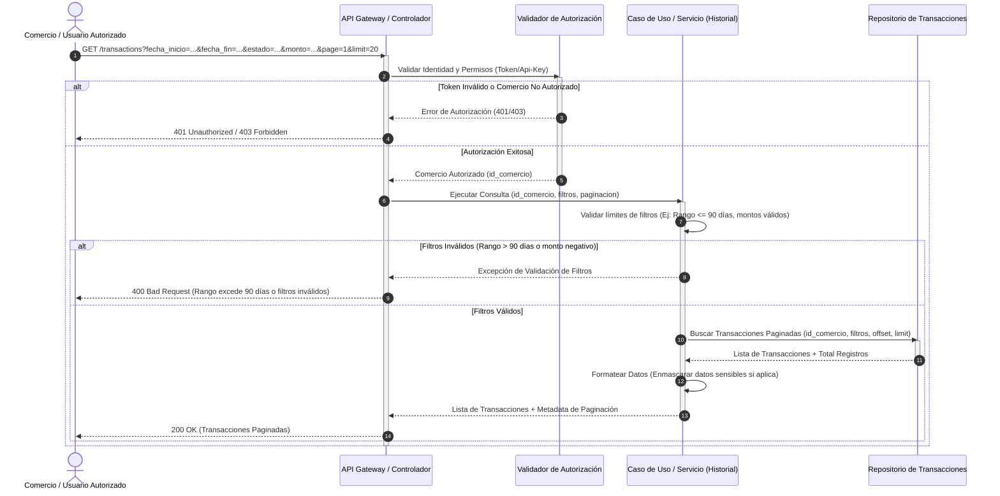

# Diagrama de Secuencia - Historial de Transacciones

## Flujos Representados

1. **Validación de Identidad y Comercio:** 
   - El componente `Validador de Autorización` verifica la firma/token del `Comercio`.
   - **Flujo alternativo de error:** Si el token no es válido o el comercio está inactivo/no autorizado, se retorna un error `401 Unauthorized` o `403 Forbidden` (Pasos 3-4).
2. **Validación de Filtros:**
   - El `Caso de Uso / Servicio` valida las reglas del negocio, principalmente que el rango de fechas consultado no sea mayor a 90 días.
   - **Flujo alternativo de error:** Si los filtros no cumplen las reglas de negocio (ej. consultar rango mayor a 90 días), se retorna un error `400 Bad Request` (Pasos 8-9).
3. **Consulta Paginada:**
   - El `Caso de Uso / Servicio` consulta al `Repositorio de Transacciones` pasándole los filtros limpios junto con los parámetros de paginación (`offset`, `limit`).
4. **Respuesta Correcta:**
   - Si todo es correcto, se formatea la respuesta (enmascarando información según sea necesario) y se devuelve una respuesta `200 OK` con la lista de transacciones y metadatos de paginación (Pasos 11-14).
