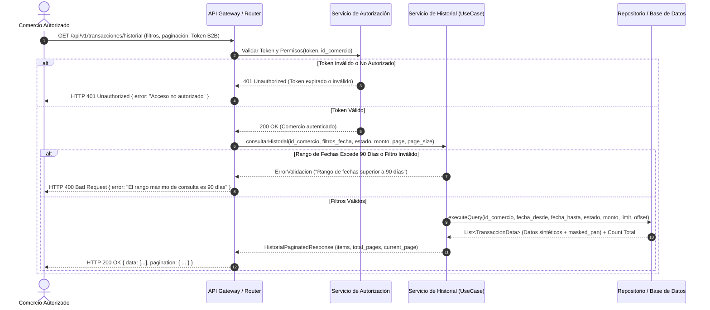

# Diagrama de Secuencia — Consulta de Historial de Transacciones

## 1. Propósito y Alcance

Este documento describe la interacción dinámica y el flujo de mensajes entre los componentes del sistema para resolver la historia de usuario **HU-01 (Consulta Paginada de Historial de Transacciones con Filtros)**.

El diagrama representa la validación de seguridad (autenticación B2B), la validación de parámetros de filtro (rango de 90 días, fechas, montos), la consulta paginada en la base de datos, la respuesta exitosa (200 OK) y los flujos alternativos de error (401 Unauthorized y 400 Bad Request).

---

## 2. Diagrama de Secuencia (Mermaid)

---

## 3. Justificación de Participantes y Flujos

1. **Comercio Autorizado (Actor):** Usuario B2B autenticado que inicia la solicitud de consulta con parámetros de filtro y token.
2. **API Gateway / Router:** Punto de entrada que enruta la solicitud y retorna las respuestas HTTP estandarizadas.
3. **Servicio de Autorización:** Componente encargado de verificar la validez del token B2B y asegurar el aislamiento entre comercios.
4. **Servicio de Historial (Caso de Uso):** Aplica la lógica de negocio, valida que el rango de fechas no supere los 90 días naturales y gestiona el cálculo de paginación (`limit` / `offset`).
5. **Repositorio / BD:** Almacena y recupera los datos de las transacciones (sin exponer PAN ni CVV).

---

## 4. Auditoría y Coherencia

- **Seguridad primero:** Se garantiza que la autorización de la petición ocurre de forma síncrona **antes** de invocar cualquier consulta a la base de datos.
- **Flujos Alternativos:** Se incluyen dos caminos de excepción claros (HTTP 401 por falla de token y HTTP 400 por violar la regla de 90 días o filtros inválidos).
- **Consistencia:** Los atributos devueltos en la respuesta coinciden estrictamente con la entidad `TRANSACCION` definida en `erd.md` y `PRD.md`.
