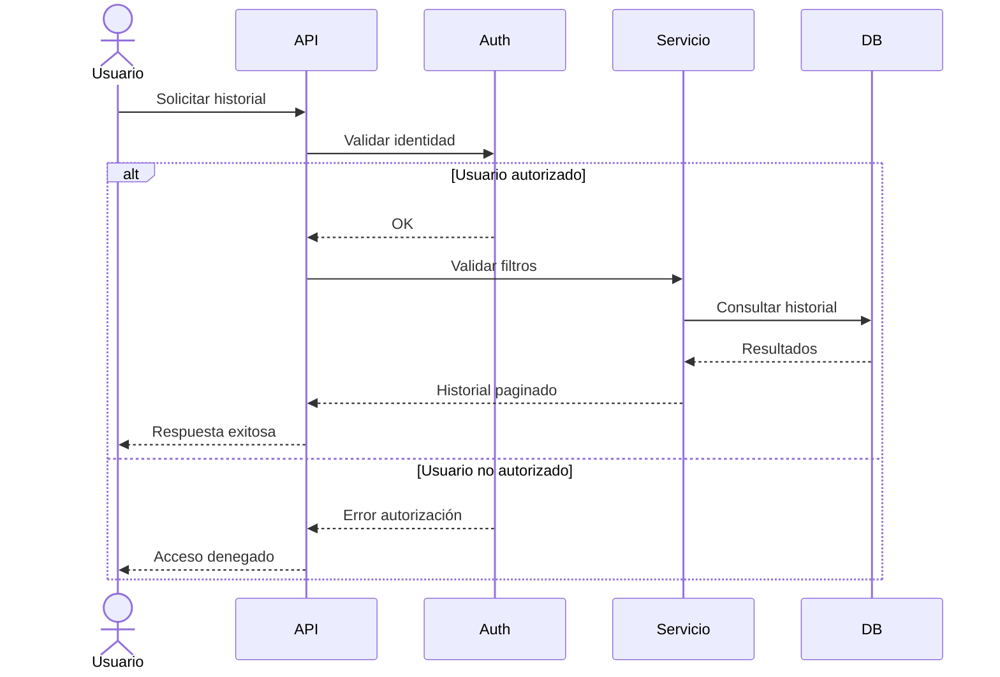

# Diagrama de Secuencia - Historial de Transacciones

## Diagrama

```mermaid
sequenceDiagram

actor Usuario

participant API
participant Auth
participant Servicio
participant DB

Usuario->>API: Solicitar historial

API->>Auth: Validar identidad

alt Usuario autorizado

Auth-->>API: OK

API->>Servicio: Validar filtros

Servicio->>DB: Consultar historial

DB-->>Servicio: Resultados

Servicio-->>API: Historial paginado

API-->>Usuario: Respuesta exitosa

else Usuario no autorizado

Auth-->>API: Error autorización

API-->>Usuario: Acceso denegado

end
```