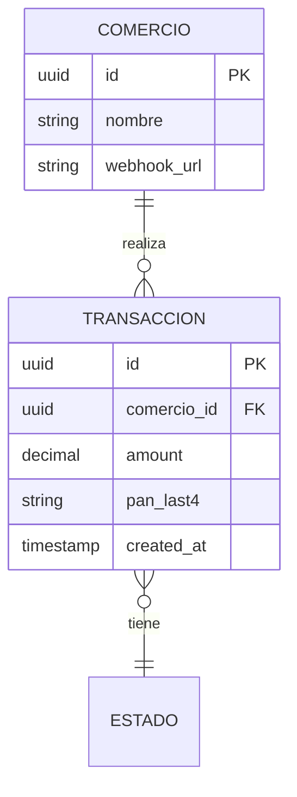

```mermaid
erDiagram
    COMERCIO ||--o{ TRANSACCION : "realiza"
    TRANSACCION }o--|| ESTADO : "tiene"

    COMERCIO {
        uuid id PK
        string nombre
        string webhook_url
    }
    TRANSACCION {
        uuid id PK
        uuid comercio_id FK
        decimal amount
        string pan_last4
        timestamp created_at
    }
```
